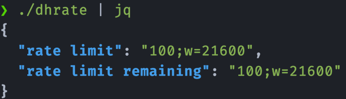

## Dockerhub Rate

A small Go program that prints the [Dockerhub rate](https://docs.docker.com/docker-hub/download-rate-limit/#how-can-i-check-my-current-rate) as an unauthenticated user. This is interesting if you respectively your Docker engine is pulling images as unauthenticated user (no `docker login` involved).

According to [Dockerhub](https://docs.docker.com/docker-hub/download-rate-limit/#i-dont-see-any-ratelimit-headers), you will not see any rate limits as authenticated Dockerhub user.
